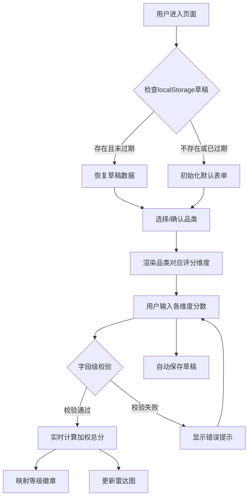

## 1. 产品概述

面向二次元手办收藏者的多维度品相评分工具，帮助用户对景品、比例手办、可动模型等不同品类手办进行系统化品相鉴定。通过结构化的评分维度与加权算法，输出客观的等级评价，并支持本地草稿持久化保存。

- 目标用户：二次元手办收藏爱好者、二手交易鉴定者
- 核心价值：将主观的手办品相判断转化为可量化、可对比的标准化评分

## 2. 核心功能

### 2.1 功能模块
1. **鉴定评分主页**：品类切换、维度评分输入、实时总分计算、等级展示
2. **可视化面板**：雷达图多维得分展示、等级徽章标识
3. **草稿系统**：自动保存本地草稿、7天过期自动清除、页面刷新恢复

### 2.2 页面详情

| 页面名称 | 模块名称 | 功能描述 |
|-----------|-------------|---------------------|
| 鉴定评分主页 | 品类选择器 | 支持景品/比例手办/可动模型三品类切换，切换时重置无效维度 |
| 鉴定评分主页 | 维度评分表单 | 动态渲染品类适用的评分维度，支持0-10分数输入、必填校验、范围校验 |
| 鉴定评分主页 | 雷达图展示 | 实时展示各维度得分的雷达图可视化 |
| 鉴定评分主页 | 总分与等级 | 加权总分实时计算，映射为神作/良品/一般三档 |
| 鉴定评分主页 | 草稿提示 | 显示草稿保存状态，支持手动清除草稿 |

## 3. 核心流程

用户进入页面 → 选择手办品类 → 系统自动加载对应评分维度模板 → 用户逐项填写各维度评分 → 实时计算加权总分并展示等级 → 雷达图同步更新 → 草稿自动保存至 localStorage → 用户可随时提交或刷新页面恢复草稿

## 4. 用户界面设计

### 4.1 设计风格
- **主色**：日系二次元风，樱花粉 `#FF6B9D` 作为主色调，搭配深紫 `#2D1B4E` 作为背景基调
- **辅助色**：金色 `#FFD700`（神作）、青绿 `#4ADE80`（良品）、橙灰 `#9CA3AF`（一般）
- **按钮风格**：圆角胶囊按钮，带微发光效果和悬浮上浮动效
- **字体**：标题使用艺术感衬线体展示，正文使用现代无衬线字体
- **布局风格**：卡片式玻璃拟态（Glassmorphism）设计，左右分栏（桌面）/上下堆叠（移动端）
- **图标风格**：Lucide 线性图标，配合柔和的霓虹光晕

### 4.2 页面设计概述

| 页面名称 | 模块名称 | UI元素 |
|-----------|-------------|-------------|
| 鉴定评分主页 | 品类选择器 | 胶囊切换Tab，选中态渐变背景发光 |
| 鉴定评分主页 | 维度评分卡片 | 玻璃拟态卡片，滑块+数字输入双模式，错误态红色边框抖动 |
| 鉴定评分主页 | 雷达图区域 | 深色背景上的彩色雷达图，数据点带脉冲动画 |
| 鉴定评分主页 | 等级徽章 | 大尺寸圆形徽章，等级切换带缩放弹跳动画 |
| 鉴定评分主页 | 草稿状态栏 | 顶部胶囊提示条，显示上次保存时间 |

### 4.3 响应式
- 桌面端（≥1024px）：左侧表单区 + 右侧可视化面板双栏布局
- 平板端（768px-1023px）：上下堆叠，雷达图区域自适应宽度
- 移动端（<768px）：单列布局，评分维度垂直排列，优化触控区域
- 全端支持键盘 Tab 顺序导航，表单元素具备 focus 视觉反馈
