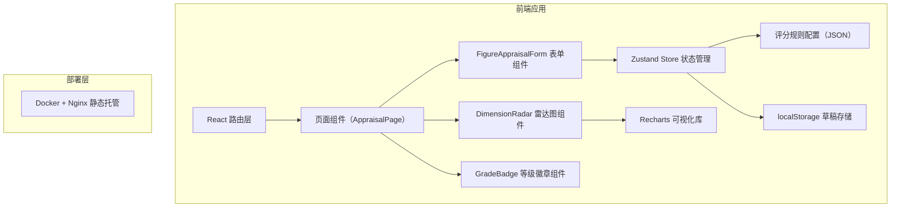

## 1. 架构设计



## 2. 技术描述

- **前端框架**：React 18 + TypeScript 5
- **构建工具**：Vite 5
- **样式方案**：Tailwind CSS 3
- **状态管理**：Zustand 4
- **可视化**：Recharts 2
- **路由**：React Router DOM 6
- **图标**：Lucide React
- **部署**：Docker + Nginx 静态文件服务

## 3. 路由定义

| 路由 | 用途 |
|-------|---------|
| `/` | 手办鉴定评分主页（AppraisalPage） |

## 4. 数据模型

### 4.1 类型定义

```typescript
export type FigureCategory = 'prize' | 'scale' | 'action';

export interface Dimension {
  key: string;
  label: string;
  description: string;
  weight: number;
  required: boolean;
  categories: FigureCategory[];
}

export interface CategoryConfig {
  name: string;
  description: string;
}

export interface ScoringConfig {
  categories: Record<FigureCategory, CategoryConfig>;
  dimensions: Dimension[];
  gradeThresholds: {
    masterpiece: number;
    good: number;
  };
}

export type GradeLevel = 'masterpiece' | 'good' | 'normal';

export interface AppraisalFormState {
  category: FigureCategory;
  scores: Record<string, number | null>;
  errors: Record<string, string>;
  draftSavedAt: number | null;
}

export interface DraftStorage {
  state: AppraisalFormState;
  savedAt: number;
  expiresAt: number;
}
```

### 4.2 评分规则配置示例

```json
{
  "categories": {
    "prize": { "name": "景品", "description": "夹娃娃机、抽奖类低价位手办" },
    "scale": { "name": "比例手办", "description": "1/7、1/8 等固定比例收藏手办" },
    "action": { "name": "可动模型", "description": "figma、SHF 等可动关节模型" }
  },
  "dimensions": [
    { "key": "painting", "label": "涂装", "description": "漆面均匀度、色彩还原、溢色情况", "weight": 0.25, "required": true, "categories": ["prize", "scale", "action"] },
    { "key": "craftsmanship", "label": "做工", "description": "模具精度、分模线、接缝处理", "weight": 0.25, "required": true, "categories": ["prize", "scale", "action"] },
    { "key": "box", "label": "盒损", "description": "外盒破损、压痕、磨损程度", "weight": 0.15, "required": true, "categories": ["prize", "scale", "action"] },
    { "key": "accessories", "label": "配件完整度", "description": "替换件、底座、说明书等是否齐全", "weight": 0.15, "required": true, "categories": ["prize", "scale", "action"] },
    { "key": "articulation", "label": "可动关节", "description": "关节灵活度、把持力、松紧度", "weight": 0.20, "required": false, "categories": ["action"] },
    { "key": "sculpt", "label": "原型雕刻", "description": "造型还原度、细节表现力", "weight": 0.20, "required": false, "categories": ["scale"] }
  ],
  "gradeThresholds": {
    "masterpiece": 85,
    "good": 70
  }
}
```

## 5. 项目结构

```
src/
├── components/
│   ├── FigureAppraisalForm.tsx  # 评分表单主组件
│   ├── DimensionRadar.tsx       # 雷达图可视化组件
│   ├── GradeBadge.tsx           # 等级徽章组件
│   ├── CategorySelector.tsx     # 品类选择器组件
│   ├── DimensionSlider.tsx      # 维度评分滑块组件
│   └── DraftStatusBar.tsx       # 草稿状态栏组件
├── config/
│   └── scoring.config.json      # 评分规则配置
├── hooks/
│   └── useDraftStorage.ts       # 草稿存储hook
├── pages/
│   └── AppraisalPage.tsx        # 鉴定评分主页
├── store/
│   └── useAppraisalStore.ts     # Zustand状态管理
├── types/
│   └── appraisal.ts             # 类型定义
├── utils/
│   ├── scoring.ts               # 评分计算工具
│   └── validation.ts            # 表单校验工具
├── App.tsx
├── main.tsx
└── index.css

docker/
├── nginx.conf                   # Nginx配置
└── Dockerfile                   # Docker构建文件

docker-compose.yml               # Docker Compose配置
```

## 6. 核心算法

### 6.1 加权总分计算

```
加权总分 = Σ(维度分 × 权重)
其中权重总和 = 1
```

### 6.2 等级映射规则

- 总分 ≥ 85 → 神作 (masterpiece)
- 70 ≤ 总分 < 85 → 良品 (good)
- 总分 < 70 → 一般 (normal)

### 6.3 品类切换逻辑

1. 获取目标品类适用的维度列表
2. 清除当前 scores 中不属于目标品类的维度分数
3. 清除对应 errors 中的错误信息
4. 更新 category 状态

### 6.4 草稿过期策略

```
过期时间 = 保存时间 + 7 × 24 × 60 × 60 × 1000 毫秒
页面加载时检查 expiresAt，过期则清除草稿
```
